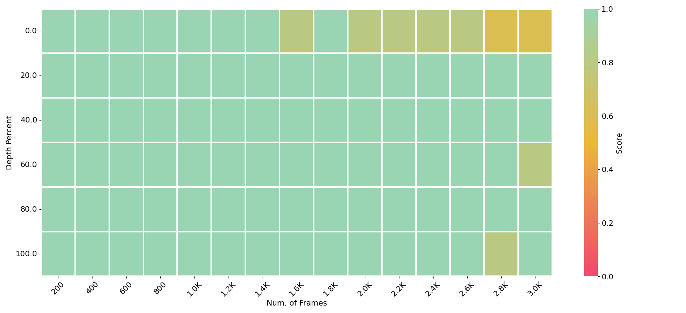
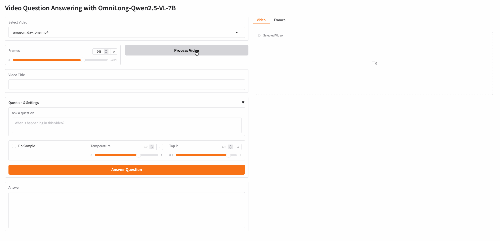

# OmniLong-Qwen2.5-VL-7B Model
`OmniLong-Qwen2.5-VL-7B` is an enhanced multimodal language model fine tuned from the [Qwen2.5-VL-7B-Instruct](https://huggingface.co/Qwen/Qwen2.5-VL-7B-Instruct) architecture, featuring significantly extended long context capabilities across both text and visual modalities. Developed through the [OmniLong: A Resource-Effective Context Scaling Framework for Multimodal LLM Fine-tuning](TBD), this model shows effective context length scaling in multimodal LLMs while reducing computational requirements through advanced sequence parallelism and strategic CPU-GPU memory management. The model demonstrates superior performance on temporal reasoning and dense captioning tasks, as evidenced by its notable results on the VideoMME leaderboard. `OmniLong-Qwen2.5-VL-7B` enables processing of high-frame-rate videos and lengthy documents with greater performance than baseline approaches, making state-of-the-art multimodal AI capabilities more accessible to researchers and practitioners.

## Model Details

- **Developed by:** [AWS Contributors](https://github.com/orgs/aws-samples/teams/aws-prototype-ml-apac)
- **Model type:** qwen2_5_vl
- **Finetuned from weights:** [Qwen2.5-VL-7B-Instruct](https://huggingface.co/Qwen/Qwen2.5-VL-7B-Instruct)
- **Supported Serving Framework:**
  - [HuggingFace transformers](https://huggingface.co/docs/transformers/index)
  - [vLLM](https://github.com/vllm-project/vllm)
  - [Large Model Inference (LMI) container on SageMaker](https://docs.aws.amazon.com/sagemaker/latest/dg/large-model-inference-container-docs.html)
- **Model License:** Apache 2.0
- **Contact:** [GitHub issues](https://github.com/awslabs/extending-the-context-length-of-open-source-llms/issues)
- **Inference Code** [Github Repo](https://github.com/awslabs/extending-the-context-length-of-open-source-llms/blob/main/long-llava-qwen2-7b/)


## Evaluations

**[1. Visual Needle In A Haystack - Pressure Testing LLMs](https://huggingface.co/datasets/lmms-lab/v_niah_needles)**
Visual Needle-In-A-Haystack (V-NIAH), a purely synthetic long vision benchmark inspired by the language model's NIAH test. The test designed 5 video question-answering problems as the needle and inserted each as a single frame into hours-long videos. We sampled the videos at 1 FPS as the visual input. The image of the needle is sourced from existing VQA benchmarks or AI-generated to avoid any contamination. The AI-generated images and questions are purposely chosen to be "counterfactual"
or "counter-commonsense", ensuring the model cannot answer based on language knowledge alone. Each question includes a "locating prompt" so that a capable system or human can locate the needle frame from the video haystack and answer the question.



The horizontal axis depicts the cumulative frames constituting the video haystack. The vertical axis indicates the positioning of the needle image within that sequence. For example, a frame depth of 0% would situate the needle image at the outset of the video. The black dotted line signifies the training duration of the backbone language model, with each frame comprising 144 tokens.

`OmniLong-Qwen2_5-VL-7B` scored averagely `97.55%` on this NIAH benchmark across different numbers of frame depths and frames shown in this plot.

**[2. MME: A Comprehensive Evaluation Benchmark for Image Understanding](https://github.com/BradyFU/Awesome-Multimodal-Large-Language-Models/tree/Evaluation)**

MME is a comprehensive evaluation benchmark for multimodal large language models. It measures both perception and cognition abilities on a total of 14 subtasks, including existence, count, position, color, poster, celebrity, scene, landmark, artwork, OCR, commonsense reasoning, numerical calculation, text translation, and code reasoning. `OmniLong-Qwen2_5-VL-7B` retains SOTAs on both perception and cognition evaluation.

|     Models         | mme_cognition_score	| mme_percetion_score |
|--------------------|----------------------|---------------------|
|**OmniLong-Qwen2_5-VL-7B** | **642.85** | 1599.28|
|[Qwen2.5-VL-7B-Instruct](https://huggingface.co/Qwen/Qwen2.5-VL-7B-Instruct) | 629.64 | **1691.36** |


**[3. VideoMME: Comprehensive Evaluation Benchmark of Multi-modal LLMs in Video Understanding](https://video-mme.github.io/home_page.html)**

Video-MME, the first-ever full-spectrum, Multi-Modal Evaluation benchmark of MLLMs in Video analysis.It covers a wide range of short videos (< 2min), Medium Video (4min ~ 15min), long video (30min ~ 60min). 900 videos with a total of 254 hours are manually selected and annotated by repeatedly viewing all the video content, resulting in 2,700 question-answer pairs. Also, subtitles are also provided with the video for evaluation.

`OmniLong-Qwen2_5-VL-7B` scored a overall `67.9%` with subtitles and `73.4%` with as shown in this table (*adapted from the [VideoMME Leaderboard](https://video-mme.github.io/home_page.html)*), which makes it the SOTA for `7B` models.

|     Models         | LLM Params | Overall (%) - w/o subs	| Overall (%) - w subs |
|--------------------|------------|-------------------------|------------------------|
|**OmniLong-Qwen2_5-VL-7B** | 7B | **67.9** | **73.4** |
|[Qwen2.5-VL-7B-Instruct](https://huggingface.co/Qwen/Qwen2.5-VL-7B-Instruct)| 7B | 65.1| 71.6 |
|[LongVA](https://github.com/EvolvingLMMs-Lab/LongVA) | 7B | 52.6 | 54.3 |
|[VideoLLaMA 2](https://github.com/DAMO-NLP-SG/VideoLLaMA2) | 7B | 47.9 | 50.3 |
|[ShareGemini](https://github.com/Share14/ShareGemini) | 7B | 43.2 | 47.9 |
|[Chat-UniVi-v1.5](https://github.com/PKU-YuanGroup/Chat-UniVi) | 7B | 40.6	| 45.9 |
|[VideoChat2-Mistral](https://github.com/OpenGVLab/Ask-Anything/tree/main/video_chat2) | 7B | 39.5 | 43.8 |
|[ST-LLM](https://github.com/TencentARC/ST-LLM) | 7B | 37.9 | 42.3 |
|[Qwen-VL-Chat](https://github.com/QwenLM/Qwen-VL) | 7B | 41.1 | 41.9 |
|[Video-LLaVA](https://github.com/PKU-YuanGroup/Video-LLaVA) |7B | 39.9 | 41.6 |


## Local Demo
This example demonstrates `OmniLong-Qwen2_5-VL-7B`'s long context capability by understanding videos. This can be useful for onboarding new developers.



### Run the Demo on your local machine (Mininum Requriement: [g6e.4xlarge](https://aws.amazon.com/ec2/instance-types/g6/) is recommended.)

To get started, please follow the instructions as below:

    git clone https://github.com/awslabs/extending-the-context-length-of-open-source-llms.git

    cd extending-the-context-length-of-open-source-llms
    conda create -n OmniLong-Qwen2_5-VL-7B python=3.10 -y
    conda activate OmniLong-Qwen2_5-VL-7B
    pip install -r OmniLong-Qwen2.5-VL-7B/demo/requirements.txt

    python OmniLong-Qwen2.5-VL-7B/demo/demo_video_understanding.py

And then open your broswer at `http://localhost:6006` or `https://xxxxxxxxxxxx.gradio.live` if `share=Ture` is enabled in `demo/demo_video_understanding.py`.

## How to use the model from Python Code (HuggingFace transformers)

OmniLong-Qwen2.5-VL-7B seamlessly integrates with the Hugging Face Transformers Python library and maintains complete compatibility with `Qwen2.5-VL-7B-Instruct`, enabling straightforward usage of the model similar to [Qwen2.5-VL-7B-Instruct](https://huggingface.co/Qwen/Qwen2.5-VL-7B-Instruct#quickstart). 

**Native Long Context Support:** The key differentiator between OmniLong-Qwen2.5-VL-7B and the standard Qwen2.5-VL-7B-Instruct lies solely in our built-in extended context processing capabilities. While the base model requires manual config.json modifications to enable YaRN for long text processing, as documented in [Qwen2.5-VL-7B-Instruct](https://huggingface.co/Qwen/Qwen2.5-VL-7B-Instruct#processing-long-texts), OmniLong handles extended contexts natively. This single yet significant enhancement eliminates configuration overhead and ensures consistent performance across all input lengths without additional setup requirements, while maintaining complete functional parity in all other aspects.

## Serve the model on vLLM
On an AWS `g6e.12xlarge` or larger instance, install vLLM as per [vLLM docs](https://vllm.readthedocs.io/en/latest/).
```shell
pip install vllm
```

### Start the server
```shell
vllm serve aws-prototyping/OmniLong-Qwen2_5-VL-7B --tensor-parallel-size 4
```

## Deploy the model on a SageMaker LMI Endpoint

Please refer to this [large model inference (LMI) container](https://docs.aws.amazon.com/sagemaker/latest/dg/large-model-inference-container-docs.html) to see how to deploy a Sagemaker LMI Endpoint.


## Limitations
Before using the `OmniLong-Qwen2_5-VL-7B` model, it is important to perform your own independent assessment, and take measures to ensure that your use would comply with your own specific quality control practices and standards, and that your use would comply with the local rules, laws, regulations, licenses and terms that apply to you, and your content.

## Citation

If you find our work helpful, feel free to give us a cite.

```
@misc{OmniLong-Qwen2_5-VL-7B-2025,
author = { {Yin Song and Chen Wu} },
title = { {aws-prototyping/OmniLong-Qwen2_5-VL-7B} },
year = 2025,
url = { https://huggingface.co/aws-prototyping/OmniLong-Qwen2_5-VL-7B },
publisher = { Hugging Face }
}
```
