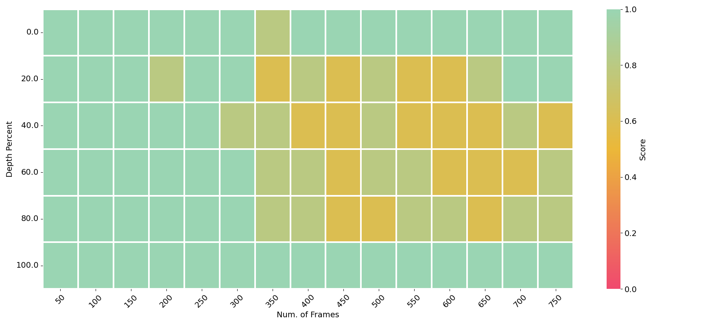

# long-llava-qwen2-7b Model

Most long context LLMs can only work in text-only mode, `long-llava-qwen2-7b` is a open source large-Context Multimodal LLM and can perform language, image, and video understanding. In stead of proposing a new model archiecture, we extended [llava](https://github.com/huggingface/transformers/tree/main/src/transformers/models/llava) to support make it support long context in a multimodal setting (i.e., multiple images, short and long videos). `long-llava-qwen2-7b` was fine-tuned from [Qwen2-7B-Instruct](https://huggingface.co/Qwen/Qwen2-7B-Instruct).

## Model Details

- **Developed by:** [AWS Contributors](https://github.com/orgs/aws-samples/teams/aws-prototype-ml-apac)
- **Model type:** llava
- **Supported languages**: 27 additional languages besides English and Chinese
  - Western Europe: German, French, Spanish, Portuguese, Italian, Dutch
  - Eastern & Central Europe:	Russian, Czech, Polish
  - Middle East: Arabic, Persian, Hebrew, Turkish
  - Eastern Asia: Japanese, Korean
  - South-Eastern Asia: Vietnamese, Thai, Indonesian, Malay, Lao, Burmese, Cebuano, Khmer, Tagalog
  - Southern Asia: Hindi, Bengali, Urdu
- **Finetuned from weights:** [Qwen2-7B-Instruct](https://huggingface.co/Qwen/Qwen2-7B-Instruct)
- **Supported Serving Framework:**
  - [HuggingFace transformers](https://huggingface.co/docs/transformers/index)
  - [vLLM](https://github.com/vllm-project/vllm)
  - [Large Model Inference (LMI) container on SageMaker](https://docs.aws.amazon.com/sagemaker/latest/dg/large-model-inference-container-docs.html)
- **Model License:** Apache 2.0
- **Contact:** [GitHub issues](https://github.com/awslabs/extending-the-context-length-of-open-source-llms/issues)
- **Inference Code** [Github Repo](https://github.com/awslabs/extending-the-context-length-of-open-source-llms/blob/main/long-llava-qwen2-7b/)


## Evaluations

**[1. Visual Needle In A Haystack - Pressure Testing LLMs](https://huggingface.co/datasets/lmms-lab/v_niah_needles)**
Visual Needle-In-A-Haystack (V-NIAH), a purely synthetic long vision benchmark inspired by the language model's NIAH test. The test designed 5 video question-answering problems as the needle and inserted each as a single frame into hours-long videos. We sampled the videos at 1 FPS as the visual input. The image of the needle is sourced from existing VQA benchmarks or AI-generated to avoid any contamination. The AI-generated images and questions are purposely chosen to be "counterfactual"
or "counter-commonsense", ensuring the model cannot answer based on language knowledge alone. Each question includes a "locating prompt" so that a capable system or human can locate the needle frame from the video haystack and answer the question.



The horizontal axis depicts the cumulative frames constituting the video haystack. The vertical axis indicates the positioning of the needle image within that sequence. For example, a frame depth of 0% would situate the needle image at the outset of the video. The black dotted line signifies the training duration of the backbone language model, with each frame comprising 576 tokens.

`long-llava-qwen2-7b` scored averagely `~88.0%` on this NIAH benchmark across different numbers of frame depths and frames shown in this plot.

**[2. MME: A Comprehensive Evaluation Benchmark for Image Understanding](https://github.com/BradyFU/Awesome-Multimodal-Large-Language-Models/tree/Evaluation)**

MME is a comprehensive evaluation benchmark for multimodal large language models. It measures both perception and cognition abilities on a total of 14 subtasks, including existence, count, position, color, poster, celebrity, scene, landmark, artwork, OCR, commonsense reasoning, numerical calculation, text translation, and code reasoning. `long-llava-qwen2-7b` achieves SOTAs on both perception and cognition evaluation.

|     Models         | mme_cognition_score	| mme_percetion_score |
|--------------------|----------------------|---------------------|
|**long_llava_qwen2_7b** | **350** | **1494.64386**|
|[llava_1.5_7b_hf](https://huggingface.co/llava-hf/llava-1.5-7b-hf) | 326.42857 |1492.13225 |


**[3. VideoMME: Comprehensive Evaluation Benchmark of Multi-modal LLMs in Video Understanding](https://video-mme.github.io/home_page.html)**

Video-MME, the first-ever full-spectrum, Multi-Modal Evaluation benchmark of MLLMs in Video analysis.It covers a wide range of short videos (< 2min), Medium Video (4min ~ 15min), long video (30min ~ 60min). 900 videos with a total of 254 hours are manually selected and annotated by repeatedly viewing all the video content, resulting in 2,700 question-answer pairs. Also, subtitles are also provided with the video for evaluation.

`long-llava-qwen2-7b` scored a overall `57.1%` with subtitles and `52.9%` with as shown in this table (*adapted from the [VideoMME Leaderboard](https://video-mme.github.io/home_page.html)*), which makes it the SOTA for `7B` models.

|     Models         | LLM Params | Overall (%) - w/o subs	| Overall (%) - w subs |
|--------------------|------------|-------------------------|------------------------|
|**long_llava_qwen2_7b** | 7B | **52.9** | **57.1** |
|[LongVA](https://github.com/EvolvingLMMs-Lab/LongVA) | 7B | 52.6 | 54.3 |
|[VideoLLaMA 2](https://github.com/DAMO-NLP-SG/VideoLLaMA2) | 7B | 47.9 | 50.3 |
|[ShareGemini](https://github.com/Share14/ShareGemini) | 7B | 43.2 | 47.9 |
|[Chat-UniVi-v1.5](https://github.com/PKU-YuanGroup/Chat-UniVi) | 7B | 40.6	| 45.9 |
|[VideoChat2-Mistral](https://github.com/OpenGVLab/Ask-Anything/tree/main/video_chat2) | 7B | 39.5 | 43.8 |
|[ST-LLM](https://github.com/TencentARC/ST-LLM) | 7B | 37.9 | 42.3 |
|[Qwen-VL-Chat](https://github.com/QwenLM/Qwen-VL) | 7B | 41.1 | 41.9 |
|[Video-LLaVA](https://github.com/PKU-YuanGroup/Video-LLaVA) |7B | 39.9 | 41.6 |


## Local Demo
This example demonstrates `long_llava_qwen2_7b`'s long context capability by understanding both images and videos. This can be useful for onboarding new developers.


### Run the Demo on your local machine (Mininum Requriement: [g5.4xlarge](https://aws.amazon.com/ec2/instance-types/g5/) is recommended.)

To get started, please follow the instructions as below:

    git clone https://github.com/awslabs/extending-the-context-length-of-open-source-llms.git

    cd long-llava-qwen2-7b
    conda create -n long-llava python=3.12 -y
    conda activate long-llava
    pip install -r local_demo/requirements.txt

    python local_demo/multimodal_chat.py

And then open your broswer at `http://localhost:6006` or `https://xxxxxxxxxxxx.gradio.live` if `share=Ture` is enabled in `local_demo/multimodal_chat.py`.

## How to use the model from Python Code (HuggingFace transformers)

First, make sure to have `transformers >= 4.42.0`. 
The model supports multi-image and multi-prompt generation. Meaning that you can pass multiple images in your prompt.

### Using `pipeline`:

Below we used [`"aws-prototyping/long-llava-qwen2-7b"`](https://huggingface.co/aws-prototyping/long-llava-qwen2-7b) checkpoint.

```python
from transformers import pipeline
from PIL import Image    
import requests

model_id = "aws-prototyping/long-llava-qwen2-7b"
pipe = pipeline("image-to-text", model=model_id)
url = "https://huggingface.co/datasets/huggingface/documentation-images/resolve/main/transformers/tasks/ai2d-demo.jpg"
image = Image.open(requests.get(url, stream=True).raw)

# Define a chat histiry and use `apply_chat_template` to get correctly formatted prompt
# Each value in "content" has to be a list of dicts with types ("text", "image") 
conversation = [
    {

      "role": "user",
      "content": [
          {"type": "text", "text": "What does the label 15 represent? (1) lava (2) core (3) tunnel (4) ash cloud"},
          {"type": "image"},
        ],
    },
]
prompt = processor.apply_chat_template(conversation, add_generation_prompt=True)

outputs = pipe(image, prompt=prompt, generate_kwargs={"max_new_tokens": 200})
print(outputs)
>>> {"generated_text": "\nUSER: What does the label 15 represent? (1) lava (2) core (3) tunnel (4) ash cloud\nASSISTANT: Lava"}
```

### Using pure `transformers`:

Below is an example script to run generation in `float16` precision on a GPU device:

```python
import requests
from PIL import Image

import torch
from transformers import AutoProcessor, LlavaForConditionalGeneration

model_id = "aws-prototyping/long-llava-qwen2-7b"
model = LlavaForConditionalGeneration.from_pretrained(
    model_id, 
    torch_dtype=torch.bfloat16, 
    low_cpu_mem_usage=True, 
).to(0)

processor = AutoProcessor.from_pretrained(model_id)

# Define a chat histiry and use `apply_chat_template` to get correctly formatted prompt
# Each value in "content" has to be a list of dicts with types ("text", "image") 
conversation = [
    {

      "role": "user",
      "content": [
          {"type": "text", "text": "What are these?"},
          {"type": "image"},
        ],
    },
]
prompt = processor.apply_chat_template(conversation, add_generation_prompt=True)

image_file = "http://images.cocodataset.org/val2017/000000039769.jpg"
raw_image = Image.open(requests.get(image_file, stream=True).raw)
inputs = processor(images=raw_image, text=prompt, return_tensors='pt').to(0, torch.float16)

output = model.generate(**inputs, max_new_tokens=200, do_sample=False)
print(processor.decode(output[0][2:], skip_special_tokens=True))
```

### Model optimization

#### 4-bit quantization through `bitsandbytes` library

First make sure to install `bitsandbytes`, `pip install bitsandbytes` and make sure to have access to a CUDA compatible GPU device. Simply change the snippet above with: 

```diff
model = LlavaForConditionalGeneration.from_pretrained(
    model_id, 
    torch_dtype=torch.float16, 
    low_cpu_mem_usage=True,
+   load_in_4bit=True
)
```

#### Use Flash-Attention 2 to further speed-up generation

First make sure to install `flash-attn`. Refer to the [original repository of Flash Attention](https://github.com/Dao-AILab/flash-attention) regarding that package installation. Simply change the snippet above with: 

```diff
model = LlavaForConditionalGeneration.from_pretrained(
    model_id, 
    torch_dtype=torch.bfloat16, 
    low_cpu_mem_usage=True,
+   use_flash_attention_2=True
).to(0)
```

## Serve the model on vLLM
On an AWS `g5.4xlarge` or larger instance, install vLLM as per [vLLM docs](https://vllm.readthedocs.io/en/latest/).
```shell
pip install vllm==0.5.5
```

### Start the server
```shell
vllm serve aws-prototyping/long-llava-qwen2-7b \
    —max_model_len 8192
```
**Important Note** - Currently vLLM serving only supports single image inference. The support of multiple images as input is on the roadmap, and please refer [Multi-modality Support Refactoring](https://github.com/vllm-project/vllm/issues/4194) for details.

### Run the client
```python
import base64

import requests
from openai import OpenAI

# Modify OpenAI's API key and API base to use vLLM's API server.
openai_api_key = "EMPTY"
openai_api_base = "http://localhost:8000/v1"

client = OpenAI(
    # defaults to os.environ.get("OPENAI_API_KEY")
    api_key=openai_api_key,
    base_url=openai_api_base,
)

models = client.models.list()
model = models.data[0].id

image_url = "https://upload.wikimedia.org/wikipedia/commons/thumb/d/dd/Gfp-wisconsin-madison-the-nature-boardwalk.jpg/2560px-Gfp-wisconsin-madison-the-nature-boardwalk.jpg"

# Use image url in the payload
chat_completion_from_url = client.chat.completions.create(
    messages=[{
        "role":
        "user",
        "content": [
            {
                "type": "text",
                "text": "What’s in this image?"
            },
            {
                "type": "image_url",
                "image_url": {
                    "url": image_url
                },
            },
        ],
    }],
    model=model,
    max_tokens=64,
)

result = chat_completion_from_url.choices[0].message.content
print(f"Chat completion output:{result}")


# Use base64 encoded image in the payload
def encode_image_base64_from_url(image_url: str) -> str:
    """Encode an image retrieved from a remote url to base64 format."""

    with requests.get(image_url) as response:
        response.raise_for_status()
        result = base64.b64encode(response.content).decode('utf-8')

    return result


image_base64 = encode_image_base64_from_url(image_url=image_url)
chat_completion_from_base64 = client.chat.completions.create(
    messages=[{
        "role":
        "user",
        "content": [
            {
                "type": "text",
                "text": "What’s in this image?"
            },
            {
                "type": "image_url",
                "image_url": {
                    "url": f"data:image/jpeg;base64,{image_base64}"
                },
            },
        ],
    }],
    model=model,
    max_tokens=64,
)

result = chat_completion_from_base64.choices[0].message.content
print(f"Chat completion output:{result}")
```

## Deploy the model on a SageMaker LMI Endpoint

Please refer to this [Jupyter Notebook](https://github.com/awslabs/extending-the-context-length-of-open-source-llms/tree/main/long-llava-qwen2-7b/notebooks/deploy-on-aws-sagemaker-long-llava-qwen2-7b.ipynb) to see how to deploy a Sagemaker [large model inference (LMI) container](https://docs.aws.amazon.com/sagemaker/latest/dg/large-model-inference-container-docs.html).


## Limitations
Before using the `long-llava-qwen2-7b` model, it is important to perform your own independent assessment, and take measures to ensure that your use would comply with your own specific quality control practices and standards, and that your use would comply with the local rules, laws, regulations, licenses and terms that apply to you, and your content.

## Citation

If you find our work helpful, feel free to give us a cite.

```
@misc{long-llava-qwen2-7b-2024,
author = { {Yin Song and Chen Wu and Eden Duthie} },
title = { {aws-prototyping/long-llava-qwen2-7b} },
year = 2024,
url = { https://huggingface.co/aws-prototyping/long-llava-qwen2-7b },
publisher = { Hugging Face }
}
```
